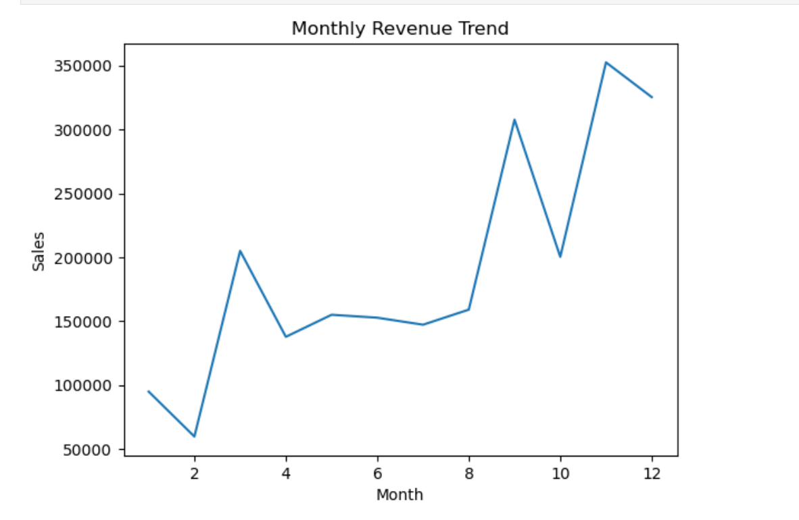
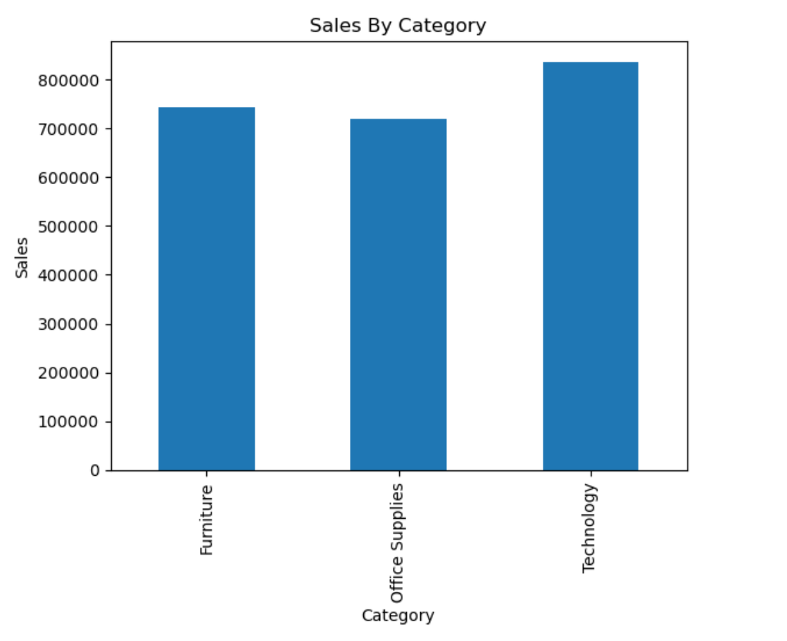
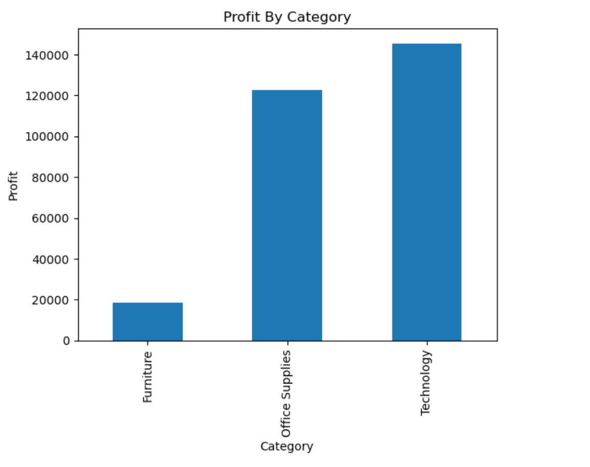

# 📊 Sales & Revenue Analysis using Python

## 📌 Project Overview

This project analyzes sales and revenue data to identify business trends, top-performing categories, and profitability using Python.

## 🛠 Tools Used

* Python (Pandas, Matplotlib)
* Data Analysis
* Data Visualization

## 📊 Key Analysis

* Revenue trends over time
* Sales by category and sub-category
* Profit analysis
* Monthly performance insights

## 📈 Key Insights

* Identified top-performing categories contributing to revenue
* Observed revenue trends across months
* Compared sales vs profit to highlight business efficiency

## 📷 Dashboard / Visuals

